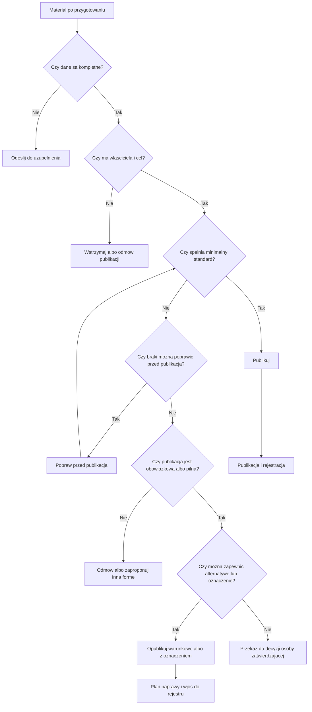

# Kontrola przed publikacją

## Rola kontroli

Kontrola przed publikacją jest miejscem, w którym materiał przestaje być tylko roboczą treścią, a staje się kandydatem do publicznego udostępnienia. Na tym etapie trzeba ustalić, czy można go opublikować, czy wymaga poprawy, uzupełnienia, oznaczenia, alternatywnej formy dostępu albo odmowy publikacji.

Kontrola obejmuje treści własne, dokumenty, załączniki, multimedia, komunikaty, posty, treści obowiązkowe w BIP oraz materiały przekazane przez inne podmioty. W praktyce to właśnie tutaj najczęściej wychodzi, czy materiał ma właściciela, cel, podstawę publikacji i realny status dostępności.

## Kontrola nie jest audytem

Kontrola przed publikacją ma charakter operacyjny. Nie jest pełnym audytem WCAG, badaniem eksperckim całego serwisu ani formalną opinią prawną. Ma wykryć podstawowe braki, zatrzymać oczywiste błędy i zostawić ślad decyzji.

Jeżeli materiał jest złożony, dotyczy ważnej usługi publicznej albo może wywołać skutki dla użytkownika, kontrola może wskazać potrzebę szerszego sprawdzenia. Wtedy warto włączyć koordynatora dostępności, osobę odpowiedzialną za BIP, prawnika albo wykonawcę technicznego.

## Bramka publikacyjna

Bramka publikacyjna to minimalny zestaw warunków, które muszą być spełnione przed publikacją. Jej sens jest prosty: redaktor nie powinien publikować materiału, którego nie da się powiązać z właścicielem, decyzją i wynikiem kontroli.

Zasada podstawowa brzmi: brak dowodu kontroli oznacza brak publikacji. Wyjątkiem może być tylko opisana i udokumentowana ścieżka publikacji pilnej albo warunkowej.

Materiał przechodzi przez bramkę, gdy istnieją:

- właściciel treści,
- cel publikacji,
- źródło materiału,
- typ treści,
- wynik właściwej listy kontrolnej,
- decyzja publikacyjna,
- informacja o czasie aktualności,
- decyzja o wpisie do rejestru,
- wskazanie osoby odpowiedzialnej za poprawę, jeżeli występują braki.

Poniższe drzewo pokazuje podstawową logikę decyzji publikacyjnej. Diagram nie zastępuje listy kontrolnej ani formularza decyzji, ale pomaga ustalić, którą ścieżkę należy zastosować po kontroli.

## Kto kontroluje

W małym podmiocie kontrolę może wykonywać redaktor albo administrator BIP. Trzeba jednak uważać, aby jedna osoba nie była jednocześnie autorem, jedynym kontrolującym i jedynym zatwierdzającym materiał w sprawach wymagających decyzji merytorycznej.

W dużej organizacji odpowiedzialność warto rozdzielić:

- właściciel treści odpowiada za poprawność merytoryczną,
- redaktor sprawdza strukturę, kompletność i przygotowanie do publikacji,
- administrator serwisu albo BIP sprawdza miejsce i techniczne warunki publikacji,
- koordynator dostępności wspiera sprawy sporne lub wysokiego ryzyka,
- osoba zatwierdzająca podejmuje decyzję, gdy materiał wymaga wyjątku, publikacji warunkowej albo odmowy.

Role są opisane w [mapach odpowiedzialności](narzedzia/mapy-odpowiedzialnosci.md).

## Co kontroluje

Kontrola obejmuje:

- cel publikacji,
- właściciela treści,
- źródło materiału,
- typ treści,
- podstawową dostępność tekstu, dokumentu, załącznika, grafiki albo multimediów,
- kompletność metadanych,
- czas aktualności,
- obowiązek publikacji,
- właściwe miejsce publikacji,
- potrzebę wpisu do rejestru,
- ewentualne braki i sposób ich obsługi.

Szczegółowe pytania znajdują się w [listach kontrolnych](narzedzia/listy-kontrolne.md).

## Kiedy kontroluje

Kontrola powinna odbyć się po przygotowaniu materiału, ale przed publikacją. Odkładanie jej na później powoduje, że organizacja najpierw tworzy problem publiczny, a dopiero potem próbuje go naprawić.

Wyjątkiem może być publikacja konieczna ze względu na obowiązek prawny albo pilny interes publiczny. W takim przypadku trzeba odnotować publikację warunkową, wskazać braki i ustalić termin uzupełnienia.

## Jak dokumentuje wynik kontroli

Wynik kontroli zapisuje się w formularzu decyzji publikacyjnej albo w rejestrze. Minimalny zapis powinien pozwolić odtworzyć, kto sprawdził materiał, jakie braki stwierdził i dlaczego materiał został opublikowany albo zatrzymany.

Taki zapis obejmuje:

- identyfikator albo tytuł materiału,
- datę kontroli,
- osobę kontrolującą,
- właściciela treści,
- wynik listy kontrolnej,
- stwierdzone braki,
- decyzję,
- termin poprawy, jeżeli dotyczy,
- osobę odpowiedzialną za poprawę,
- powiązanie z rejestrem zasobów albo zgłoszeniem dostępności.

Wzór znajduje się w rozdziale [Formularze](narzedzia/formularze.md).

## Tabela dowodów kontroli

| Sytuacja | Wymagany dowód | Miejsce zapisu |
|---|---|---|
| zwykła publikacja | lista kontrolna i decyzja publikacyjna | formularz albo rejestr zasobów |
| dokument lub załącznik | wynik kontroli dokumentu, status dostępności | rejestr załączników |
| multimedia | lista kontrolna wideo, audio albo grafiki | rejestr zasobów, opis publikacji |
| treść od innego podmiotu | formularz przekazania, klasyfikacja A/B/C/D | rejestr treści zewnętrznych |
| treść BIP | podstawa obowiązku, decyzja, status dostępności | rejestr zasobów lub BIP |
| publikacja warunkowa | uzasadnienie, termin naprawy, osoba odpowiedzialna | formularz decyzji publikacyjnej |
| publikacja pilna | notatka po publikacji i późniejsze uzupełnienie kontroli | rejestr lub formularz uproszczony |

## Klasyfikacja decyzyjna

### Publikuj

Ta decyzja jest właściwa, gdy materiał spełnia minimalny standard publikacji, ma właściciela, określony cel, czas aktualności i wynik kontroli bez istotnych braków.

### Popraw przed publikacją

Tę decyzję stosuje się wtedy, gdy braki można usunąć przed publikacją, a termin nie wynika z pilnego obowiązku albo interesu publicznego.

### Odeślij do uzupełnienia

Materiał trzeba odesłać, gdy brakuje danych potrzebnych do kontroli, na przykład celu publikacji, właściciela, podstawy obowiązku, wersji dostępnej, zgody na modyfikację albo informacji o źródle.

### Opublikuj warunkowo

To decyzja wyjątkowa. Można ją zastosować, gdy publikacja jest potrzebna w określonym terminie, a braki nie uniemożliwiają podstawowego dostępu do informacji albo zostanie zapewniona alternatywna forma dostępu. Decyzja musi zawierać termin naprawy i osobę odpowiedzialną.

### Opublikuj z oznaczeniem

Ta ścieżka dotyczy materiału, który musi być opublikowany, ale ma znane braki dostępności, których podmiot nie może natychmiast usunąć. Oznaczenie powinno informować o braku i sposobie uzyskania treści w formie dostępnej. Nie może zastępować naprawy, jeżeli naprawa jest możliwa i zasadna.

### Odmów publikacji

Odmowa jest zasadna, gdy materiał nie jest obowiązkowy, nie ma celu publicznego, nie ma właściciela, nie można ustalić źródła, narusza standard albo podmiot przekazujący nie uzupełnia braków możliwych do poprawy.

### Przekaż do procedury żądania dostępności

Tę decyzję stosuje się wtedy, gdy sprawa wynika ze zgłoszenia użytkownika albo gdy publikacja materiału niedostępnego wymaga zapewnienia alternatywnej formy dostępu. Powiązanie powinno zostać odnotowane w [rejestrze zgłoszeń dostępności](narzedzia/rejestry.md).

## Kiedy można opublikować

Publikacja jest dopuszczalna, gdy:

- materiał ma właściciela,
- cel publikacji jest określony,
- podstawowa dostępność została sprawdzona,
- braki nie występują albo zostały sklasyfikowane,
- ustalono czas aktualności,
- wybrano właściwe miejsce publikacji,
- wiadomo, czy zasób wymaga wpisu do rejestru.

## Kiedy należy poprawić

Poprawa przed publikacją jest wymagana, gdy:

- dokument jest skanem bez warstwy tekstowej,
- film z wypowiedziami nie ma napisów,
- grafika zawiera informację niedostępną w tekście,
- linki są niejednoznaczne,
- załącznik nie ma opisu,
- tabele nie mają nagłówków,
- brakuje metadanych potrzebnych do rejestru.

## Kiedy należy odmówić publikacji

Odmowa publikacji jest zasadna, gdy materiał nie jest obowiązkowy i:

- nie da się ustalić właściciela,
- nie ma celu publicznego,
- źródło jest niejasne,
- podmiot zewnętrzny nie uzupełnia braków,
- materiał wymaga zmian, których nie można wykonać bez zgody autora, a brak jest obowiązku publikacji,
- publikacja wprowadziłaby użytkownika w błąd.

## Kiedy zapewnić alternatywną formę dostępu

Alternatywna forma dostępu jest potrzebna, gdy użytkownik nie może skorzystać z opublikowanej treści z powodu braku dostępności, a zasób jest potrzebny do realizacji sprawy, prawa, obowiązku albo uzyskania informacji publicznej. Może to być inny plik, opis tekstowy, transkrypcja, odczytanie treści, pomoc pracownika albo inne rozwiązanie adekwatne do potrzeby.

## Typowe błędy

- mylenie kontroli operacyjnej z pełnym audytem,
- publikowanie bez decyzji, bo materiał jest pilny,
- brak dokumentowania publikacji warunkowej,
- stosowanie oznaczenia braku dostępności bez planu naprawy,
- przerzucanie odpowiedzialności z właściciela treści na redaktora,
- brak powiązania kontroli z rejestrem.

## Powiązane narzędzia

Kontrola korzysta z [list kontrolnych](narzedzia/listy-kontrolne.md), [formularza decyzji publikacyjnej](narzedzia/formularze.md), [rejestru zasobów](05-rejestr-zasobow.md), [rejestrów operacyjnych](narzedzia/rejestry.md), [schematu kontroli przed publikacją](narzedzia/schematy-procesow.md), [publikacji w BIP](procesy/publikacja-w-bip.md) i [publikacji kryzysowej](procesy/publikacja-kryzysowa.md).
