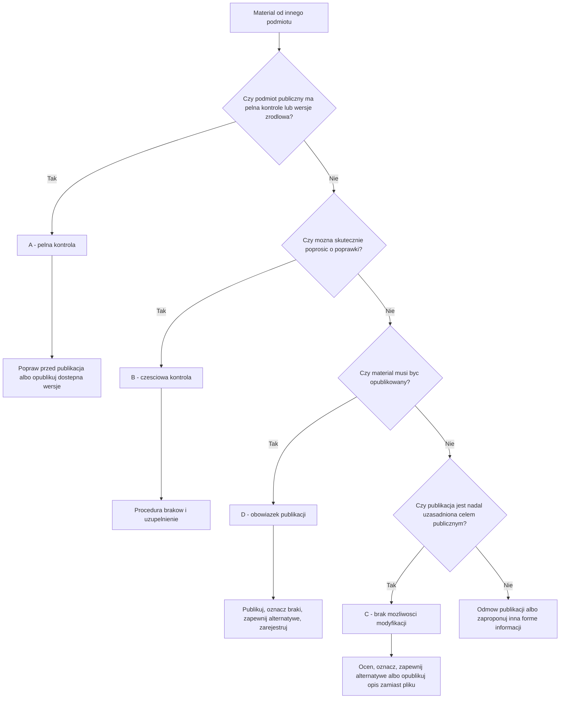

# Treści od innych podmiotów

## Rola rozdziału

Ten rozdział opisuje standard publikowania treści pochodzących od innych podmiotów. Bazuje na logice Zalecenia 6: podmiot publiczny może otrzymywać materiały z zewnątrz, ale nadal odpowiada za własną decyzję publikacyjną, sposób oznaczenia treści i obsługę użytkownika.

Publikacja cudzego materiału w serwisie podmiotu publicznego nie powinna być automatyczna. Materiał trzeba przyjąć, sklasyfikować, sprawdzić, udokumentować i dopiero wtedy podjąć decyzję.

## Definicja treści pochodzącej od innego podmiotu

Treść pochodząca od innego podmiotu to materiał przygotowany poza podmiotem publikującym, który ma zostać opublikowany w jego kanale komunikacji. Może to być dokument, załącznik, grafika, plakat, nagranie, informacja o wydarzeniu, regulamin, ogłoszenie, komunikat, formularz albo materiał przekazany przez wykonawcę, partnera, organizatora, instytucję współpracującą lub organ zewnętrzny.

## Odpowiedzialność za decyzję publikacyjną

Podmiot publiczny nie zawsze odpowiada za stworzenie materiału, ale odpowiada za decyzję, że publikuje go w swoim kanale. Odpowiedzialność obejmuje:

- kwalifikację materiału,
- ocenę, czy publikacja jest obowiązkowa,
- ustalenie, czy materiał można poprawić,
- decyzję o oznaczeniu braków,
- zapewnienie alternatywnej formy dostępu, gdy jest potrzebna,
- wpis do rejestru,
- obsługę żądań dostępności.

Nie wolno automatycznie uznawać treści zewnętrznej za wyłączoną z wymagań dostępności tylko dlatego, że pochodzi od innego podmiotu.

## Klasyfikacja A/B/C/D

Klasyfikacja A/B/C/D służy ustaleniu, jaką kontrolę ma podmiot publiczny nad materiałem i jaką decyzję może podjąć. Poniższe drzewo pomaga przejść od pytania o kontrolę nad materiałem do decyzji operacyjnej.

### A - pełna kontrola

Materiał pochodzi od innego podmiotu, ale podmiot publikujący może go modyfikować albo ma dostęp do wersji źródłowej. Przykład: dokument przygotowany przez wykonawcę na zlecenie podmiotu publicznego.

Decyzja: wymagać poprawy przed publikacją albo poprawić materiał w ramach procesu.

### B - częściowa kontrola

Podmiot publikujący może poprosić o poprawki, ale nie ma pełnej kontroli nad materiałem. Przykład: plakat partnera wydarzenia albo dokument przekazany przez organizację współpracującą.

Decyzja: zastosować procedurę braków, żądać uzupełnienia, a w razie potrzeby zapewnić opis, transkrypcję albo inną informację równoważną.

### C - brak możliwości modyfikacji

Materiał nie może być zmieniony przez podmiot publikujący, a poprawki u źródła są niemożliwe albo nieuzasadnione. Przykład: dokument historyczny, pismo otrzymane w określonej formie, materiał dowodowy.

Decyzja: ocenić, czy publikacja jest potrzebna, czy można opublikować informację tekstową zamiast pliku, czy należy oznaczyć brak dostępności i zapewnić alternatywną formę dostępu.

### D - obowiązek publikacji

Materiał musi być opublikowany z mocy prawa, procedury albo obowiązku informacyjnego, na przykład w BIP. Braki dostępności nie usuwają obowiązku publikacji, ale wymagają udokumentowania i działań zapewniających dostępność w możliwym zakresie.

Decyzja: opublikować zgodnie z obowiązkiem, oznaczyć braki, zapewnić alternatywną formę dostępu i wprowadzić zasób do rejestru.

## Formularz przekazania materiału

Każdy materiał zewnętrzny powinien być przekazany z formularzem. Wzór znajduje się w rozdziale [Formularze](narzedzia/formularze.md).

Formularz powinien zawierać:

- dane podmiotu przekazującego,
- osobę do kontaktu,
- tytuł materiału,
- cel publikacji,
- podstawę obowiązku publikacji, jeżeli istnieje,
- zgodę albo brak zgody na modyfikacje,
- informację o dostępności,
- listę załączników,
- wymagany termin publikacji,
- czas aktualności,
- informację, czy materiał był wcześniej publikowany,
- wskazanie wersji źródłowej, jeżeli istnieje.

## Procedura braków

Jeżeli materiał ma braki, należy:

1. opisać braki,
2. ustalić, czy braki można usunąć,
3. przekazać podmiotowi zewnętrznemu informację o wymaganych poprawkach,
4. wyznaczyć termin uzupełnienia,
5. odnotować odpowiedź,
6. podjąć decyzję publikacyjną.

Braki mogą dotyczyć dostępności, danych organizacyjnych, podstawy publikacji, zgody na modyfikację, wersji źródłowej albo informacji o aktualności.

## Informacja o brakach w materiale

Informacja o brakach powinna być konkretna. Nie wystarczy napisać, że materiał jest niedostępny. Trzeba wskazać, co jest problemem, na przykład:

- plik jest skanem bez warstwy tekstowej,
- film nie ma napisów,
- grafika zawiera tekst niewystępujący w opisie,
- dokument nie ma nagłówków,
- tabela nie ma nagłówków kolumn,
- brakuje podstawy obowiązku publikacji,
- brakuje informacji o czasie aktualności.

## Oznaczenie treści objętej wyłączeniem albo brakiem

Jeżeli publikacja następuje mimo braku dostępności, użytkownik powinien otrzymać jasną informację:

- czego dotyczy brak,
- czy materiał pochodzi od innego podmiotu,
- czy podmiot publikujący może go poprawić,
- jak uzyskać treść w formie dostępnej,
- gdzie zgłosić potrzebę zapewnienia dostępności.

Oznaczenie nie powinno sugerować, że każdy materiał zewnętrzny jest automatycznie poza odpowiedzialnością podmiotu publikującego.

## Treść obowiązkowa w BIP

Jeżeli materiał jest obowiązkowy w BIP, należy go opublikować zgodnie z obowiązkiem, ale jednocześnie:

- odnotować podstawę obowiązku,
- oznaczyć braki dostępności, jeżeli występują,
- zapewnić alternatywną formę dostępu, gdy jest potrzebna,
- wpisać zasób do rejestru,
- zaplanować naprawę albo wskazać uzasadnienie pozostawienia bez naprawy.

Szczegółowy proces jest w [schematach procesów](narzedzia/schematy-procesow.md).

## Decyzja o odmowie publikacji

Odmowa publikacji jest możliwa, gdy materiał nie jest obowiązkowy, nie ma celu publicznego, nie ma właściciela, nie można ustalić źródła albo podmiot zewnętrzny nie uzupełnia braków możliwych do usunięcia.

Odmowa powinna być udokumentowana w formularzu decyzji publikacyjnej i w rejestrze treści od innych podmiotów, jeżeli taki rejestr jest prowadzony.

## Instrukcja dla podmiotów zewnętrznych

Podmiot publiczny powinien przekazywać zewnętrznym autorom krótką instrukcję. Powinna ona wyjaśniać:

- jakie formaty są akceptowane,
- że skany nie są właściwą formą dokumentu tekstowego,
- że film z mową wymaga napisów,
- że grafika informacyjna wymaga tekstu równoważnego,
- że należy przekazać wersję źródłową, gdy jest dostępna,
- jakie dane trzeba wpisać w formularzu,
- że materiał może zostać odesłany do poprawy albo nieopublikowany.

## Materiały według decyzji

| Rodzaj materiału | Sposób postępowania |
|---|---|
| Materiał, który można poprawić | poprawić przed publikacją albo odesłać do poprawy |
| Materiał, którego nie można poprawić | ocenić potrzebę publikacji, oznaczyć braki, zapewnić alternatywę |
| Materiał, którego nie trzeba publikować | odmówić publikacji albo zaproponować inną formę informacji |
| Materiał, który trzeba opublikować z mocy prawa | opublikować, oznaczyć, zarejestrować, zapewnić dostęp alternatywny |
| Materiał wymagający alternatywnej formy dostępu | powiązać z procedurą żądania dostępności i rejestrem zgłoszeń |

## Obsługa żądań zapewnienia dostępności

Jeżeli użytkownik zgłasza brak dostępności treści zewnętrznej, podmiot publikujący powinien obsłużyć zgłoszenie w swoim procesie. Może zwrócić się do podmiotu źródłowego, przygotować wersję alternatywną, udostępnić informację w innej formie albo podjąć decyzję o naprawie, zastąpieniu, archiwizacji lub wycofaniu.

Zgłoszenie należy powiązać z [rejestrem zgłoszeń dostępności](narzedzia/rejestry.md) i rekordem zasobu.

## Typowe błędy

- automatyczne publikowanie materiałów zewnętrznych,
- uznawanie każdego materiału zewnętrznego za wyłączony,
- brak formularza przekazania,
- brak informacji o zgodzie na modyfikacje,
- publikowanie plakatu bez treści tekstowej,
- publikowanie obowiązkowego materiału bez oznaczenia braków,
- brak obsługi żądania dostępności, bo "to nie nasz dokument".

## Powiązane narzędzia

Stosuj [formularz przekazania materiału przez podmiot zewnętrzny](narzedzia/formularze.md), [listę kontrolną treści od innego podmiotu](narzedzia/listy-kontrolne.md), [rejestr treści od innych podmiotów](narzedzia/rejestry.md), [mapy odpowiedzialności](narzedzia/mapy-odpowiedzialnosci.md) i [schemat publikacji treści od innego podmiotu](narzedzia/schematy-procesow.md).
