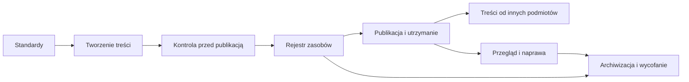

# Zarządzanie dostępną treścią publiczną

**Podręcznik projektowania, publikowania, utrzymywania i porządkowania treści publicznych zgodnie z wymaganiami dostępności cyfrowej.**

Ten podręcznik opisuje system pracy z treścią publiczną: od przygotowania materiału, przez kontrolę przed publikacją, rejestrację zasobu, obsługę treści od innych podmiotów, przegląd i naprawę, aż po archiwizację i wycofanie.

Nie jest to zbiór dobrych praktyk ani jednorazowa instrukcja publikacji. To model zarządzania treścią w czasie, oparty na odpowiedzialności, decyzjach, rejestrach i narzędziach wdrożeniowych.

## Po co powstał ten podręcznik

W wielu organizacjach publicznych treść cyfrowa jest traktowana jako pojedynczy komunikat, plik, post, dokument albo załącznik. W praktyce każda taka treść jest zasobem, który ma właściciela, status, historię decyzji i wpływ na użytkownika.

Brak systemu prowadzi do typowych problemów:

- publikowania treści bez kontroli dostępności,
- braku odpowiedzialności za materiały po publikacji,
- gromadzenia nieaktualnych dokumentów,
- przypadkowego zarządzania załącznikami,
- trudności w obsłudze zgłoszeń dostępności,
- braku wiedzy, co należy poprawić, zarchiwizować albo wycofać.

Podręcznik pokazuje, jak przejść od reaktywnego poprawiania błędów do systemowego zarządzania treścią publiczną.

## Dla kogo jest ten podręcznik

Podręcznik jest przeznaczony dla:

- osób odpowiedzialnych za komunikację cyfrową,
- redaktorów stron WWW i BIP,
- koordynatorów dostępności,
- administratorów serwisów,
- osób publikujących dokumenty i multimedia,
- kierowników komórek organizacyjnych,
- instytucji publicznych, które chcą uporządkować proces publikacji i utrzymania treści.

## Jak korzystać z podręcznika

Podręcznik można czytać jako pełny model cyklu życia treści albo wykorzystywać punktowo przy wdrażaniu konkretnego procesu.

Najprostsza ścieżka pracy:

1. **Standardy publikacji** – co musi spełniać treść.
2. **Tworzenie treści** – jak przygotować materiał przed kontrolą.
3. **Kontrola przed publikacją** – jak podjąć decyzję o publikacji.
4. **Rejestr zasobów** – jak zachować wiedzę o treści w czasie.
5. **Treści od innych podmiotów** – jak obsługiwać materiały zewnętrzne.
6. **Przegląd i naprawa** – jak utrzymywać jakość po publikacji.
7. **Archiwizacja i wycofanie** – jak zakończyć cykl życia zasobu.
8. **Narzędzia systemowe** – jak przełożyć model na formularze, listy, rejestry, mapy i schematy.

## Główna zasada

Treść publiczna nie kończy się w momencie publikacji.

Każda treść powinna mieć:

- właściciela,
- status,
- wynik kontroli,
- miejsce w rejestrze,
- plan utrzymania,
- możliwość przeglądu,
- decyzję o dalszym losie.

## Model podręcznika

## Podgląd online

Aktualna wersja podręcznika jest dostępna pod adresem:

<https://bwilk-umjaslo.github.io/Zarzadzanie-dostepna-trescia-publiczna/>

## Autor

Autorem podręcznika jest Bartłomiej Wilk. Więcej informacji znajduje się w rozdziale [O autorze](11-o-autorze.md).
