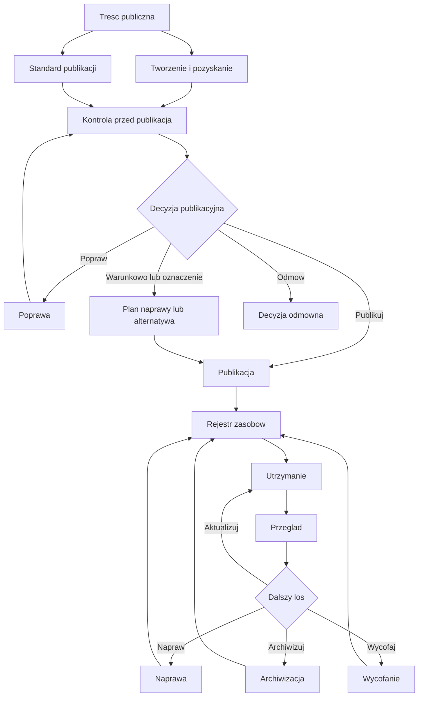
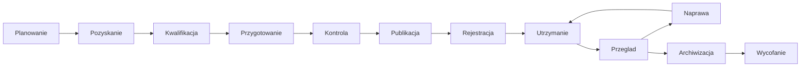

# Zarządzanie dostępną treścią publiczną

**Podręcznik operacyjny dla podmiotów publicznych, które publikują treści cyfrowe i muszą utrzymać nad nimi kontrolę także po publikacji.**

W praktyce treść publiczna rzadko kończy się na samym kliknięciu „opublikuj”. Dokument trzeba później odnaleźć, poprawić, powiązać ze zgłoszeniem dostępności, zastąpić nowszą wersją albo wycofać z widocznej struktury serwisu. Jeśli organizacja nie ustali tego wcześniej, szybko traci wiedzę o tym, co właściwie jest publicznie dostępne i kto za to odpowiada.

Ten podręcznik porządkuje pracę z treścią publiczną. Pokazuje, jak przygotować standard publikacji, podzielić odpowiedzialność, sprawdzić materiał przed publikacją, prowadzić rejestry i wracać do zasobów wtedy, gdy wymagają przeglądu, naprawy, archiwizacji albo wycofania.

Treść publiczna jest zasobem, a nie jednorazowym komunikatem. Zasób ma właściciela, status, wynik kontroli, miejsce w rejestrze i dalszy los. Publikacja jest decyzją organizacyjną, a dostępność cyfrowa jest częścią procesu, nie poprawką wykonywaną po fakcie.

## Czym jest ten podręcznik

To materiał wdrożeniowy dla osób, które pracują ze stronami internetowymi, BIP, dokumentami, załącznikami, multimediami, komunikacją masową i materiałami przekazywanymi przez inne podmioty. Łączy wymagania dostępności z codzienną praktyką redakcyjną, administracyjną i organizacyjną.

Pomaga ustalić:

- kto odpowiada za treść,
- jakie wymagania trzeba spełnić przed publikacją,
- kiedy materiał można opublikować,
- kiedy trzeba go poprawić albo odesłać,
- kiedy można zastosować publikację warunkową,
- jak rejestrować zasoby,
- jak planować przegląd i naprawę,
- jak obsługiwać żądania zapewnienia dostępności,
- jak archiwizować albo wycofywać treści.

## Czym nie jest ten podręcznik

Nie jest to zbiór luźnych dobrych praktyk, poradnik stylistyczny ani skrócony audyt WCAG. Nie zastępuje przepisów prawa, audytu dostępności cyfrowej ani decyzji kierownictwa w sprawach organizacyjnych.

Ma służyć pracy. Jego zadaniem jest przełożyć wymagania dostępności i obowiązki publikacyjne na powtarzalne procedury, formularze, listy kontrolne, rejestry i schematy odpowiedzialności.

## Dla kogo jest ten podręcznik

Z podręcznika mogą korzystać:

- redaktorzy stron WWW i BIP,
- administratorzy serwisów i BIP,
- osoby przygotowujące dokumenty, załączniki, multimedia i komunikaty,
- koordynatorzy dostępności,
- kierownicy komórek organizacyjnych,
- osoby zatwierdzające publikację,
- podmioty publiczne przyjmujące materiały od innych instytucji, wykonawców, partnerów albo organizatorów wydarzeń,
- małe jednostki, w których jedna osoba łączy kilka ról,
- duże organizacje, które potrzebują jasnego podziału odpowiedzialności.

## Jaki problem rozwiązuje

W wielu organizacjach treść cyfrowa powstaje szybciej niż system jej utrzymania. Materiały trafiają do publikacji z poczty, z dokumentów roboczych, od innych komórek, od podmiotów zewnętrznych, z mediów społecznościowych, z wydarzeń i z obowiązków BIP. Część z nich jest sprawdzana, część nie. Część ma właściciela, część zostaje bez opiekuna. Część jest aktualna, ale nikt tego nie potwierdza.

Skutkiem jest chaos publikacyjny:

- dokumenty są publikowane jako skany bez warstwy tekstowej,
- kluczowe informacje są ukryte w załącznikach,
- multimedia nie mają napisów, transkrypcji albo audiodeskrypcji,
- treści od innych podmiotów są publikowane bez kwalifikacji,
- nie wiadomo, które dokumenty i załączniki wymagają naprawy,
- nie ma informacji, kto odpowiada za aktualność i dostępność zasobu,
- żądania dostępności są obsługiwane reaktywnie, bez powiązania z rejestrem i planem napraw.

Podręcznik pokazuje, jak zatrzymać ten mechanizm zanim stanie się stałym sposobem pracy.

## Jak korzystać z podręcznika

Najpierw warto przyjąć wspólną logikę systemu, opisaną we [Wstępie](01-wstep.md). Potem można przejść przez podstawowe moduły:

1. [Standardy publikacji](02-standardy-publikacji.md) - minimalne wymagania dla tekstów, dokumentów, załączników, grafik, multimediów, social media i komunikacji masowej.
2. [Tworzenie treści](03-tworzenie-tresci.md) - przygotowanie materiału przed kontrolą i publikacją.
3. [Kontrola przed publikacją](04-kontrola-przed-publikacja.md) - centralny punkt decyzyjny.
4. [Rejestr zasobów](05-rejestr-zasobow.md) - pamięć organizacyjna dla treści.
5. [Treści od innych podmiotów](06-tresci-od-innych-podmiotow.md) - kwalifikacja, braki, oznaczenia i odpowiedzialność za decyzję publikacyjną.
6. [Przegląd i naprawa](07-przeglad-i-naprawa.md) - utrzymanie dokumentów, załączników i innych zasobów, które pozostają publicznie dostępne.
7. [Archiwizacja i wycofanie](08-archiwizacja-i-wycofanie.md) - domknięcie cyklu życia treści.
8. [Narzędzia systemowe](09-narzedzia-systemowe.md) - formularze, listy, rejestry, mapy odpowiedzialności i schematy procesów.

Rozdziały narzędziowe można stosować od razu przy pracy operacyjnej: [listy kontrolne](narzedzia/listy-kontrolne.md), [formularze](narzedzia/formularze.md), [rejestry](narzedzia/rejestry.md), [mapy odpowiedzialności](narzedzia/mapy-odpowiedzialnosci.md) i [schematy procesów](narzedzia/schematy-procesow.md).

## Podstawowa zasada podręcznika

Każda treść publiczna powinna mieć właściciela, status, wynik kontroli, miejsce w rejestrze, zasady utrzymania oraz określony dalszy los.

## Główne moduły systemu

System zarządzania treścią publiczną składa się z siedmiu modułów:

- standard publikacji - określa wymagania minimalne,
- tworzenie i pozyskanie materiału - zbiera treść oraz dane potrzebne do dalszego zarządzania,
- kontrola przed publikacją - prowadzi do decyzji, czy materiał można opublikować,
- rejestr zasobów - utrwala informację o zasobie i odpowiedzialności,
- utrzymanie, przegląd i naprawa - ogranicza starzenie się treści i narastanie zaległości dostępnościowych,
- obsługa żądań dostępności - łączy zgłoszenia użytkowników z decyzjami o naprawie,
- archiwizacja i wycofanie - kończy cykl życia zasobu w sposób udokumentowany.

Poniższy diagram pokazuje, że moduły nie działają oddzielnie. Standard publikacji zasila kontrolę, kontrola prowadzi do decyzji, publikacja tworzy zasób w rejestrze, a rejestr uruchamia utrzymanie, przegląd, naprawę i decyzję o dalszym losie.

## Model cyklu życia treści publicznej

## Model organizacyjny według pięciu obszarów

Podręcznik można wdrażać przez pięć obszarów organizacyjnych:

| Obszar | Decyzje do podjęcia | Role | Narzędzia | Ryzyka do kontroli | Rozdziały |
|---|---|---|---|---|---|
| Cele | Po co publikujemy, jak długo treść jest aktualna, czy publikacja jest obowiązkowa | właściciel treści, kierownik, osoba zatwierdzająca | formularz przekazania, decyzja publikacyjna | publikowanie bez celu, brak terminu przeglądu | [Wstęp](01-wstep.md), [Tworzenie treści](03-tworzenie-tresci.md) |
| Ludzie | Kto tworzy, kontroluje, zatwierdza, publikuje i utrzymuje zasób | autor, redaktor, administrator, koordynator dostępności | mapa odpowiedzialności | rozmycie odpowiedzialności, jednoosobowa nieformalna kontrola | [Mapy odpowiedzialności](narzedzia/mapy-odpowiedzialnosci.md) |
| Struktura | Jak przebiega proces i gdzie zapada decyzja | redaktor, kierownik, administrator BIP | schemat procesu, lista kontrolna | omijanie kontroli, brak dokumentacji decyzji | [Kontrola przed publikacją](04-kontrola-przed-publikacja.md), [Schematy procesów](narzedzia/schematy-procesow.md) |
| Technologia | Gdzie publikujemy, jak rejestrujemy i jak kontrolujemy zasoby | administrator serwisu, redaktor, koordynator | rejestr zasobów, rejestr załączników | brak wyszukiwalności, brak danych o statusie dostępności | [Rejestr zasobów](05-rejestr-zasobow.md), [Rejestry](narzedzia/rejestry.md) |
| Otoczenie | Jak obsługujemy materiały zewnętrzne, obowiązki BIP i żądania dostępności | podmiot zewnętrzny, administrator BIP, właściciel treści | formularz zewnętrzny, rejestr zgłoszeń | automatyczne publikowanie cudzych materiałów, brak alternatywnej formy dostępu | [Treści od innych podmiotów](06-tresci-od-innych-podmiotow.md), [Przegląd i naprawa](07-przeglad-i-naprawa.md) |

## Podgląd online

Aktualna wersja podręcznika jest dostępna pod adresem:

<https://bwilk-umjaslo.github.io/Zarzadzanie-dostepna-trescia-publiczna/>

## Autor

Informacja o charakterze i praktycznym pochodzeniu podręcznika znajduje się w rozdziale [O autorze](11-o-autorze.md).
