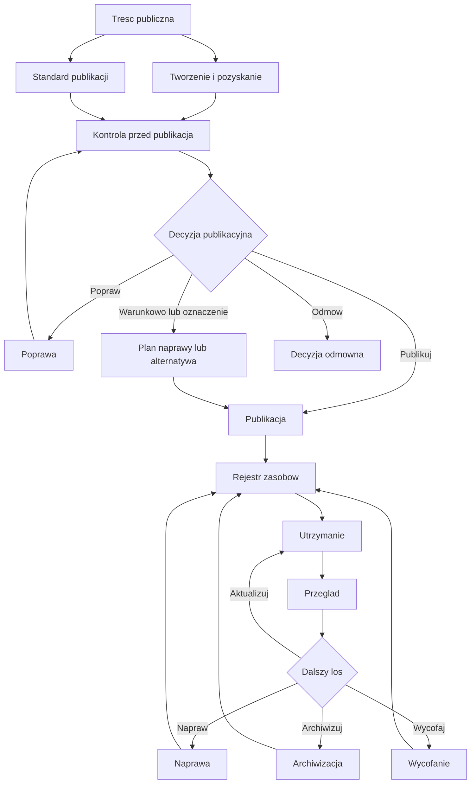
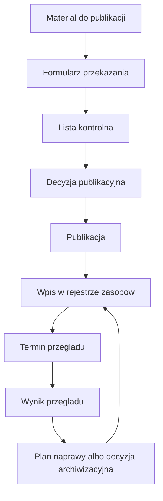
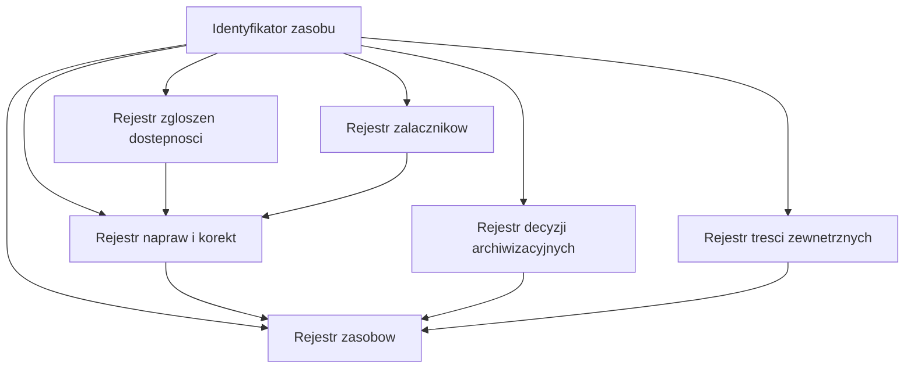

# Elementy wizualne w podręczniku

## Rola elementów wizualnych

Element wizualny w podręczniku powinien pomagać zrozumieć system, proces, decyzję albo relację między narzędziami. Nie powinien pełnić funkcji dekoracyjnej. Jeżeli obraz, diagram albo grafika nie ułatwia podjęcia decyzji, wdrożenia procedury albo zrozumienia zależności, nie powinien być dodawany.

W podręczniku preferowane są diagramy Mermaid, ponieważ:

- są zapisane tekstowo w pliku Markdown,
- można je wersjonować w repozytorium,
- można je łatwo poprawiać,
- zachowują logikę procesu w źródle,
- nie wymagają osobnej obsługi plików graficznych,
- ograniczają ryzyko publikacji niedostępnego obrazu bez opisu.

## Zasada dostępności diagramów

Każdy diagram powinien mieć opis tekstowy przed diagramem albo po diagramie. Opis powinien wyjaśniać, co diagram pokazuje i jaką decyzję wspiera. Sam diagram nie może być jedynym miejscem przekazania informacji.

Minimalny opis diagramu powinien zawierać:

- cel diagramu,
- punkt startowy,
- najważniejsze decyzje,
- rezultat procesu,
- powiązane narzędzia albo rozdziały.

## Kiedy dodawać diagram

Diagram warto dodać, gdy rozdział opisuje:

- cykl życia treści,
- zależności między rolami,
- decyzję publikacyjną,
- kwalifikację treści od innego podmiotu,
- ocenę dokumentów i załączników,
- obsługę zgłoszeń dostępności,
- archiwizację i wycofanie,
- relacje między rejestrami,
- przepływ dowodów wykonania.

Diagramu nie należy dodawać, gdy:

- powiela prostą listę,
- jest dekoracyjny,
- zawiera zbyt dużo tekstu,
- wymagałby częstej aktualizacji bez wyraźnej korzyści,
- nie da się go zrozumiale opisać tekstowo.

## Typy elementów wizualnych zalecane w podręczniku

| Typ | Zastosowanie | Preferowana forma |
|---|---|---|
| Mapa systemu | pokazuje moduły podręcznika i ich zależności | Mermaid flowchart |
| Cykl życia | pokazuje etapy od planowania do wycofania | Mermaid flowchart LR |
| Drzewo decyzji | wspiera wybór decyzji publikacyjnej lub archiwizacyjnej | Mermaid flowchart TD |
| RACI | pokazuje odpowiedzialność ról | tabela Markdown |
| Relacje rejestrów | pokazują powiązanie identyfikatorów i wpisów | Mermaid flowchart |
| Oś czasu | pokazuje kolejność publikacji, przeglądu i naprawy | Mermaid flowchart LR |
| Matryca zgodności | łączy wymagania, procedury i dowody | tabela Markdown |

## Mapa systemu podręcznika

Poniższy diagram pokazuje, że podręcznik nie jest zbiorem niezależnych rozdziałów. Standardy, kontrola, rejestry, przegląd, naprawa i archiwizacja tworzą jeden system zarządzania zasobem.

## Mapa dowodów wykonania

Poniższy diagram pokazuje, gdzie w procesie powstają dowody, które pozwalają wykazać należytą staranność.

## Mapa relacji rejestrów

Poniższy diagram pokazuje, że rejestry nie powinny być osobnymi tabelami bez powiązań. Ich wspólnym punktem powinien być identyfikator zasobu.

## Proponowane miejsca elementów wizualnych w podręczniku

| Rozdział | Element wizualny | Status |
|---|---|---|
| Strona startowa | mapa całego systemu i cykl życia treści | zalecane |
| Wstęp | uproszczony cykl życia treści | zalecane |
| Podstawy prawne i standardy | matryca wymóg - procedura - dowód | zalecane jako tabela |
| Standardy publikacji | matryca typów treści | dodana jako tabela |
| Kontrola przed publikacją | drzewo decyzji publikacyjnej | zalecane |
| Rejestr zasobów | relacje rejestrów | zalecane |
| Treści od innych podmiotów | klasyfikacja A/B/C/D jako drzewo decyzji | zalecane |
| Przegląd i naprawa | priorytety i decyzje po przeglądzie | zalecane |
| Archiwizacja i wycofanie | drzewo dalszego losu zasobu | zalecane |
| Narzędzia systemowe | mapa narzędzi i dowodów | zalecane |
| Schematy procesów | pełne diagramy operacyjne | już stosowane |

## Reguły utrzymania diagramów

Diagram jest zasobem podręcznika. Dlatego powinien być aktualizowany, gdy zmienia się proces, nazwa decyzji, rola albo rejestr. Przy każdej większej zmianie rozdziału należy sprawdzić, czy diagram nadal odpowiada tekstowi.

Minimalna lista kontrolna dla diagramu:

- czy diagram ma opis tekstowy,
- czy nazwy decyzji są takie same jak w rozdziale,
- czy role są zgodne z mapą odpowiedzialności,
- czy diagram nie zawiera informacji, której nie ma w tekście,
- czy diagram nie jest jedynym nośnikiem ważnej informacji,
- czy kod Mermaid buduje się poprawnie.
