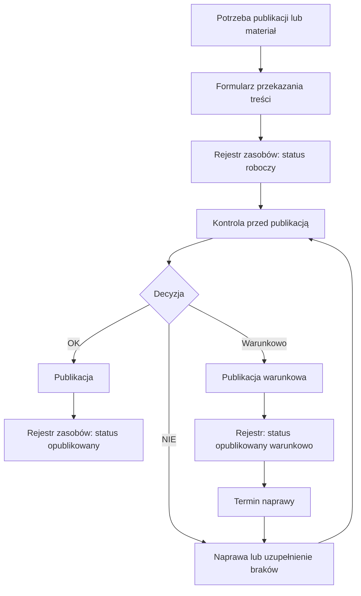
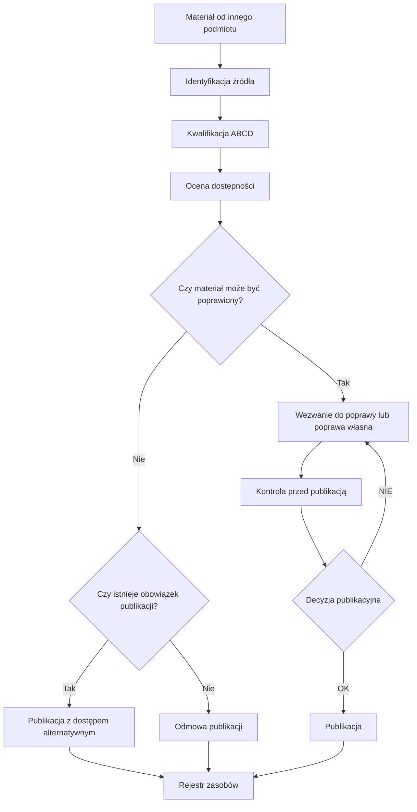
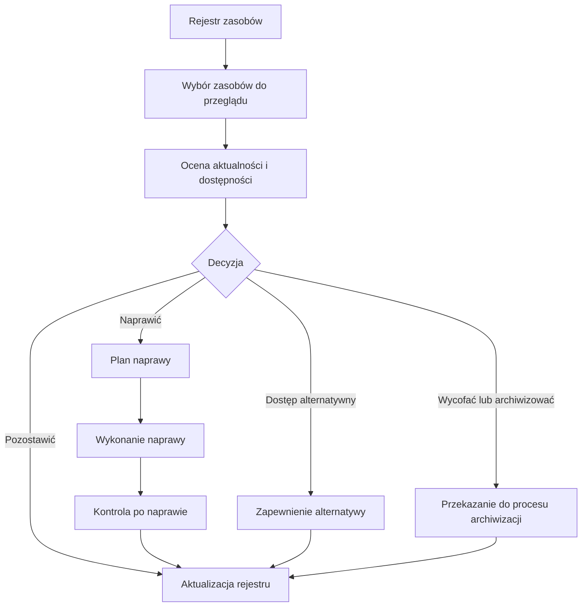
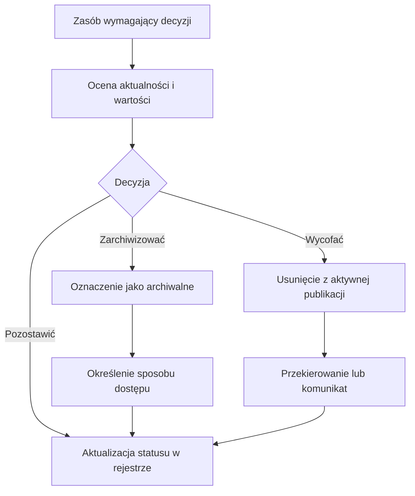
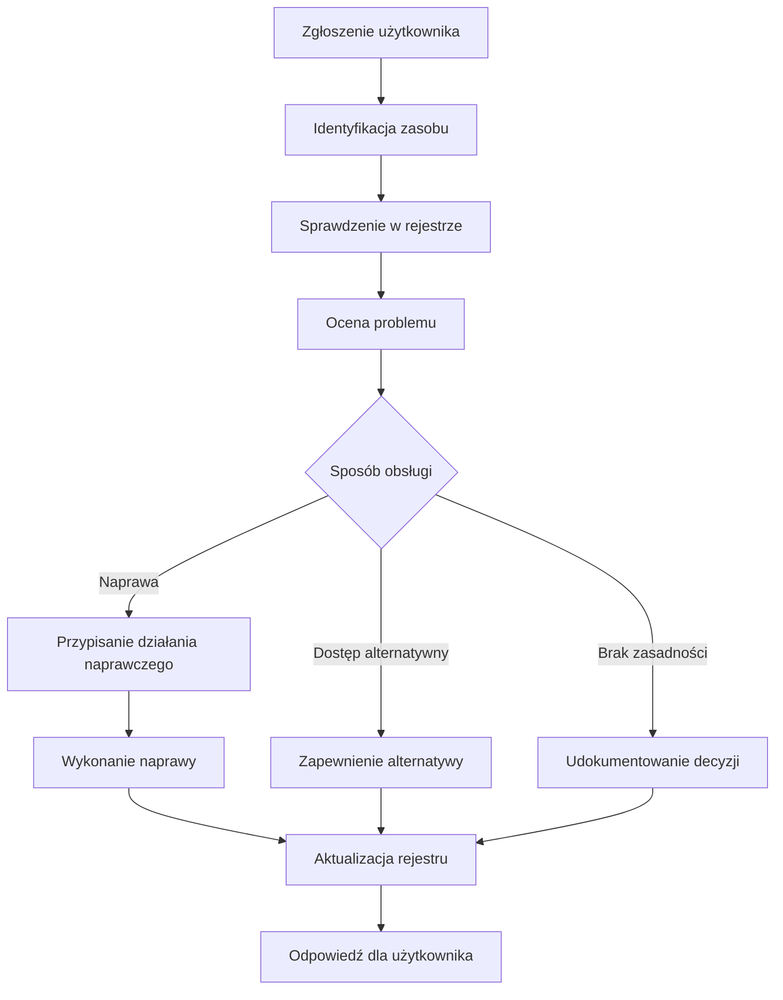

# Schematy procesów

## Rola schematów procesów w systemie

Schematy procesów przedstawiają przebieg działań związanych z zarządzaniem treścią publiczną w sposób uporządkowany i zrozumiały.

Ich celem nie jest opisanie teorii, ale pokazanie:
- kolejności działań,
- punktów decyzyjnych,
- odpowiedzialności,
- powiązań między etapami.

Schemat procesowy pozwala przełożyć opis podręcznika na rzeczywisty sposób działania organizacji.

## Zasada podstawowa

Każdy proces powinien być możliwy do przedstawienia w formie schematu.

Oznacza to, że:
- wiadomo, od czego proces się zaczyna,
- wiadomo, jakie są jego etapy,
- wiadomo, gdzie zapada decyzja,
- wiadomo, kto odpowiada za dany krok,
- wiadomo, jaki jest wynik procesu.

Jeżeli nie da się narysować procesu, to najczęściej oznacza, że nie jest on dobrze zdefiniowany.

## Elementy schematu

Schemat procesu powinien zawierać:

- punkt startowy,
- kolejne kroki procesu,
- punkty decyzyjne,
- możliwe ścieżki,
- przypisanie odpowiedzialności,
- punkt końcowy.

Schemat powinien być możliwie prosty i czytelny.

## Proces tworzenia i publikacji treści

## Proces obsługi treści od innych podmiotów

## Proces przeglądu i naprawy

## Proces archiwizacji i wycofania

## Proces obsługi zgłoszeń dostępności

## Powiązanie z mapami odpowiedzialności

Schematy procesów powinny być powiązane z mapami odpowiedzialności. Każdy krok powinien mieć przypisaną rolę, decyzje powinny mieć właściciela, a proces nie powinien zawierać pustych etapów.

## Powiązanie z narzędziami

Schematy procesów powinny wskazywać, gdzie wykorzystywane są:

- formularze jako wejście do procesu,
- listy kontrolne jako weryfikacja,
- rejestry jako zapis wyników,
- mapy odpowiedzialności jako przypisanie ról.

## Odniesienia

- [Materiały źródłowe](../../_sources/sdc/)
