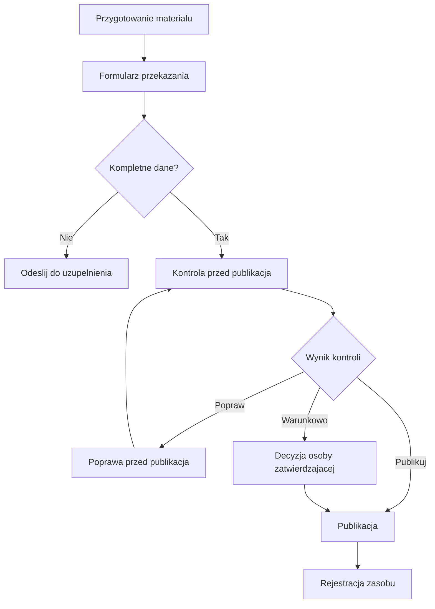
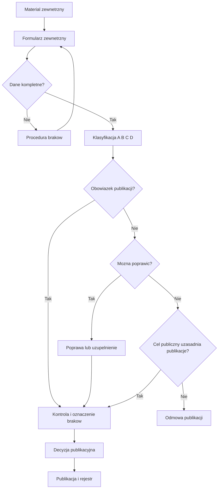
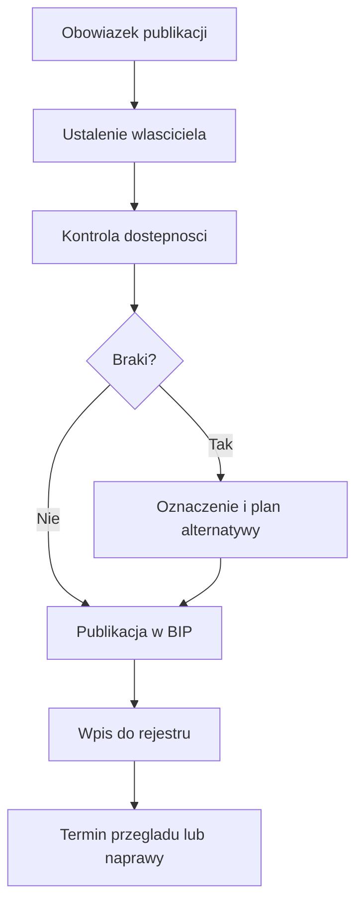
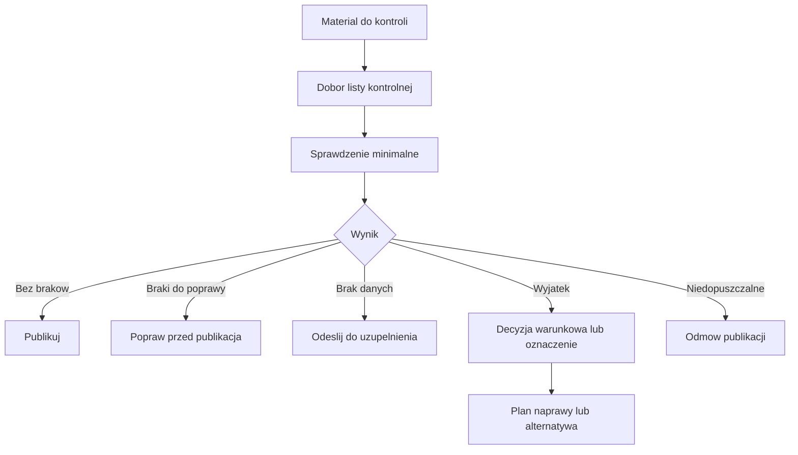
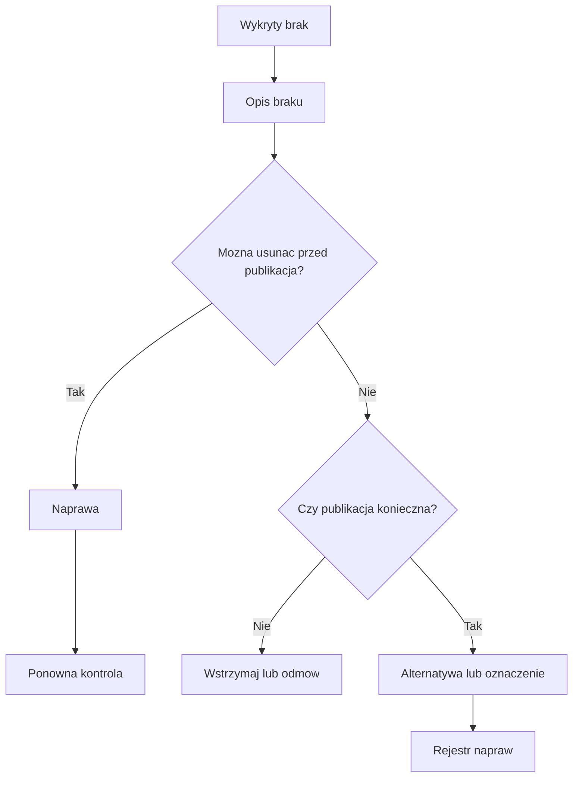
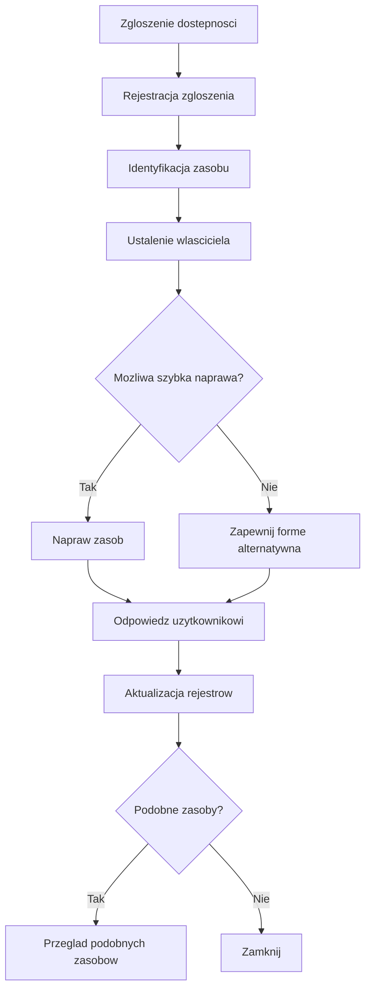
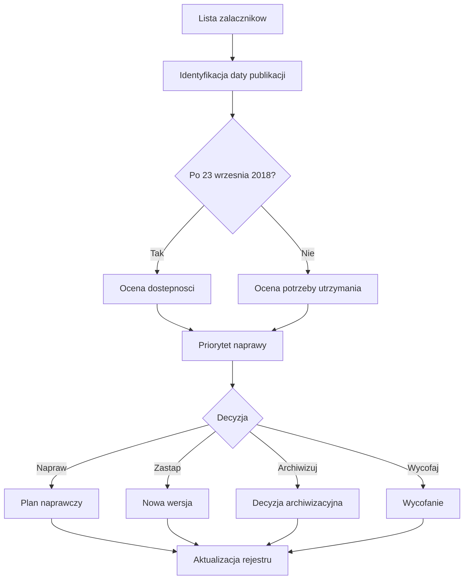
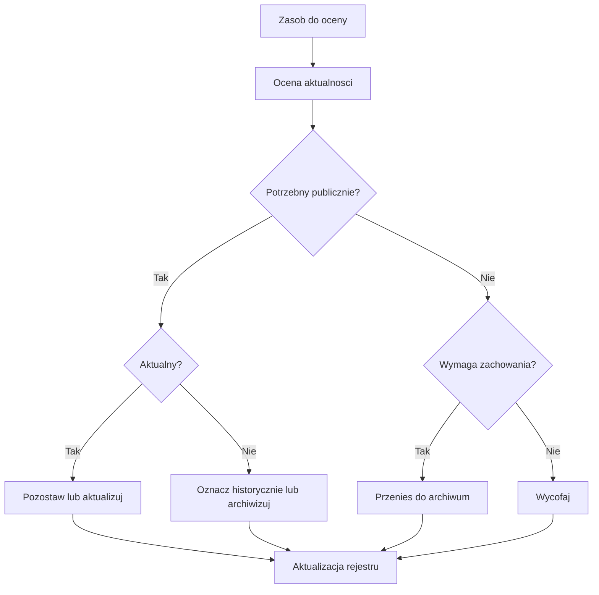

# Schematy procesów

## Zasada stosowania

Schemat procesu pokazuje punkt startowy, uczestników, decyzje, rezultat i powiązane narzędzia. Diagram Mermaid jest pomocą wdrożeniową, ale opis procesu jest równie ważny jak sam diagram.

## Publikacja treści własnej

Cel: opublikowanie materiału przygotowanego przez podmiot publiczny.

Punkt startowy: autor albo komórka merytoryczna przygotowuje materiał.

Uczestnicy: autor, właściciel treści, redaktor, osoba kontrolująca, osoba zatwierdzająca, administrator serwisu.

Decyzje: czy materiał jest kompletny, czy spełnia standard, czy wymaga rejestru.

Rezultat: opublikowany i zarejestrowany zasób albo materiał odesłany do poprawy.

Powiązane narzędzia: formularz przekazania, lista kontrolna, formularz decyzji publikacyjnej, rejestr zasobów.

## Publikacja treści od innego podmiotu

Cel: przyjęcie, kwalifikacja i publikacja albo odmowa publikacji materiału zewnętrznego.

Punkt startowy: podmiot zewnętrzny przekazuje materiał.

Uczestnicy: podmiot zewnętrzny, osoba przyjmująca, redaktor, właściciel merytoryczny, koordynator dostępności, osoba zatwierdzająca.

Decyzje: klasyfikacja A/B/C/D, możliwość poprawy, obowiązek publikacji, oznaczenie braków.

Rezultat: publikacja, publikacja warunkowa, oznaczenie, alternatywna forma dostępu albo odmowa.

Powiązane narzędzia: formularz zewnętrzny, lista kontrolna treści zewnętrznej, rejestr treści od innych podmiotów.

## Publikacja treści obowiązkowej w BIP

Cel: opublikowanie treści wymaganej przepisem albo obowiązkiem informacyjnym.

Punkt startowy: powstaje obowiązek publikacji.

Uczestnicy: właściciel treści, administrator BIP, redaktor, koordynator dostępności, osoba zatwierdzająca.

Decyzje: miejsce w BIP, dostępność materiału, oznaczenie braków, alternatywna forma dostępu.

Rezultat: publikacja w BIP z wpisem do rejestru i planem naprawy, jeżeli występują braki.

Powiązane narzędzia: formularz decyzji publikacyjnej, lista dokumentu albo załącznika, rejestr zasobów, rejestr załączników.

## Kontrola przed publikacją

Cel: podjęcie decyzji, czy materiał można opublikować.

Punkt startowy: materiał jest gotowy do sprawdzenia.

Uczestnicy: redaktor, właściciel, koordynator dostępności, osoba zatwierdzająca.

Decyzje: publikuj, popraw, odeślij, warunkowo, z oznaczeniem, odmów, przekaż do żądania dostępności.

Rezultat: udokumentowana decyzja.

Powiązane narzędzia: listy kontrolne, formularz braku dostępności, formularz decyzji.

## Obsługa braków dostępności

Cel: opisanie i usunięcie braków wykrytych przed publikacją albo po publikacji.

Punkt startowy: wykryto brak dostępności.

Uczestnicy: osoba zgłaszająca, właściciel, redaktor, koordynator dostępności, osoba naprawiająca.

Decyzje: poprawić, zapewnić alternatywę, opublikować warunkowo, odmówić, przekazać do żądania dostępności.

Rezultat: brak usunięty, oznaczony albo obsłużony alternatywnie.

Powiązane narzędzia: formularz braku dostępności, rejestr napraw, rejestr zgłoszeń.

## Obsługa żądania zapewnienia dostępności

Cel: zapewnienie użytkownikowi dostępu do treści i wykorzystanie zgłoszenia do poprawy zasobu.

Punkt startowy: wpływa żądanie zapewnienia dostępności.

Uczestnicy: osoba przyjmująca, właściciel zasobu, koordynator dostępności, redaktor, administrator.

Decyzje: sposób zapewnienia dostępności, termin, naprawa zasobu, przegląd podobnych zasobów.

Rezultat: udzielona odpowiedź, zapewniona dostępność albo alternatywa, zaktualizowany rejestr.

Powiązane narzędzia: rejestr zgłoszeń dostępności, rejestr zasobów, rejestr napraw.

## Przegląd i naprawa załączników

Cel: identyfikacja, klasyfikacja i naprawa załączników, szczególnie opublikowanych po 23 września 2018 r.

Punkt startowy: rejestr albo przegląd serwisu wskazuje załączniki.

Uczestnicy: redaktor, właściciel, koordynator dostępności, osoba naprawiająca, osoba decyzyjna.

Decyzje: naprawić, zastąpić, wycofać, archiwizować, pozostawić z uzasadnieniem.

Rezultat: plan naprawczy i aktualny status zasobu.

Powiązane narzędzia: rejestr załączników, formularz wyniku przeglądu, rejestr napraw.

## Archiwizacja i wycofanie zasobu

Cel: zakończenie albo zmiana statusu zasobu po utracie aktualności.

Punkt startowy: przegląd, zgłoszenie, zmiana przepisów, nowa wersja albo decyzja właściciela.

Uczestnicy: właściciel, redaktor, administrator, koordynator dostępności, osoba zatwierdzająca.

Decyzje: aktualizuj, pozostaw, archiwizuj, usuń z nawigacji, wycofaj, zastąp, pozostaw historycznie.

Rezultat: zasób zaktualizowany, zarchiwizowany, wycofany albo oznaczony.

Powiązane narzędzia: formularz decyzji archiwizacyjnej, rejestr zasobów, rejestr decyzji.

